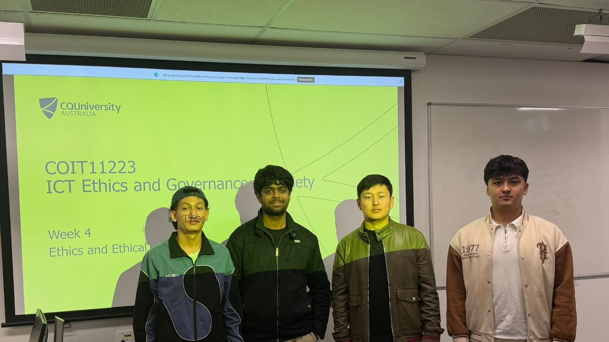

# COIT11223 ICT Ethics and Governance in Society

# e-Portfolio 2 – Ethical Theory (Kantian Ethics)

Student Name: Jahongir Karshiev

Student Number: 12332957

---

# Artefact 1: Introduction to Kantian Ethics

Source: https://youtu.be/QAegvKeHn9U?si=pAkADi75c6taDUfT

## Summary of the artefact
This video explains the basic ideas of Kantian Ethics and the philosophy of Immanuel Kant. It focuses on the idea that people should make ethical decisions based on their moral duties and principles, rather than only thinking about the consequences. It also explains the importance of treating people with respect and not using them simply as a means to achieve a personal goal. I found this useful because it gave me a simple introduction to Kantian Ethics.

## Justification on why I chose the artefact
When I first heard about Kantian Ethics, there were elements of the ideas which confused me – particularly the idea of moral duty. So, I thought it would be helpful if I could find an easy explanation of the theories behind Kantian ethics.
I decided on using this video as the content gave me an accessible insight into what was really happening behind the scenes of this approach to ethics. As someone who has had to make many choices during the course of their career, it’s interesting to see how these can be framed through different theories and the way the author explained ethical decision-making in terms of situations we face every day helps us to recognise our responsibilities in relation to other people. In particular, it encouraged me to consider issues such as my own responsibility towards people when working within Information & Communication Technology (ICT).
# Artefact 2: News Article

Source:
https://news.ku.edu/news/article/ai-can-imitate-morality-without-actually-possessing-it-new-philosophy-study-finds

## Summary of the artefact
This article discusses whether artificial intelligence can really be considered moral or whether it can only imitate human moral behaviour. The article explains research based on Kantian ethics and suggests that AI systems can follow patterns that look like moral reasoning, even though they are not moral agents themselves. It also explains how Kantian ideas about duty, principles and ethical behaviour could be used when developing AI systems. I found this interesting because it connects an ethical theory from philosophy with a modern ICT issue.

## Justification on why I chose the artefact
For this reason, I decided on this topic as I am always fascinated with different types of ethical theories and how they relate to what we see around us. In particular, how can we connect Kantian Ethics to something such as Technology and A.I.? This really made me sit back and consider my own actions as well as those performed by other individuals around me.

Furthermore, it prompted me to consider if these principles are applicable to Artificial Intelligence Systems – i.e., can artificial intelligence become moral without understanding it? Given that all of us (as students) will be studying some form of ICT and ultimately working within this field, it is essential for current and future professionals to understand how technologies can affect people.

---

# Artefact 3: Scholarly Article

Source

https://www.frontiersin.org/journals/artificial-intelligence/articles/10.3389/frai.2025.1710410/full

## Summary of the artefact
This research article compares how artificial intelligence and humans respond to different moral situations. The researchers examined responses from ChatGPT and Claude to 12 moral scenarios and compared them with previous human responses. The study found that the AI systems did not always follow one type of ethical reasoning. Instead, their decisions changed depending on the situation, sometimes showing deontological reasoning and sometimes utilitarian reasoning. I found this interesting because it shows that AI can produce different ethical answers depending on the situation, rather than simply following one fixed moral rule.

## Justification on why I chose the artefact
The reason why i have picked out this particular article is because of its direct relevance to my subject matter – the relationship between Kantian Ethics and Artificial Intelligence.
As someone who frequently uses artificial intelligence (AI) tools, what particularly piqued my interest was the article’s focus on the differences between AI and human moral decisions. 
I felt that through using an article that discussed the intersectionality of AI ethics and traditional ethical theories such as Kantianism, I would become more aware of how much these two things are different. I found myself realising that even though an AI might generate an answer that appears to make sense, the actual level of understanding may differ greatly from our own.

# Artefact 4: Workshop Personal Reflection

Previously I believed making an ethical choice meant looking at which option gave the best results but once I studied Kant’s ideas, this has completely shifted the way I now think about ethics.  In particular, I found the concept of duty, honesty and respecting others very relevant to considering my potential future career within the ICT industry.
For example, suppose I develop a system that collects user’s personal information – I can’t just focus on whether or not the system works perfectly because this fails to address questions such as: have we been respectful when dealing with users’ information? Are their rights protected?
A lot of what makes this topic interesting and meaningful to me is reflecting upon how dependent we all are on various technologies to get through each day and often times, don't know what happens to our personal information or even understand the processes behind some of these decisions. Given that, the prospect of having an opportunity to create technologies that impact people’s lives directly makes me reflect further on the importance of becoming a great ICT professional not just for myself but also in terms of ensuring those who benefit from the technologies created by me, are treated respectfully and appropriately.

# AI Planning Statement

I used AI during the planning stage of this assessment to help organise ideas, identify suitable artefacts, and improve the structure of my portfolio. I reviewed the suggested information, checked all sources, and wrote the final reflections in my own words.

---

# References (CQU Harvard Style)
# References

Barabadi, E., Fotuhabadi, Z., Arghavan, A. and Booth, J.R. (2026) ‘Comparing AI and human moral reasoning: context-sensitive patterns beyond utilitarian bias’, *Frontiers in Artificial Intelligence*, 8, 1710410. doi:10.3389/frai.2025.1710410.

Helpful Professor Explains! (2025) ‘What is Kantian Ethics? (Easy Explanation)’, YouTube video. Available at: https://youtu.be/QAegvKeHn9U (Accessed: 12 August 2026).

Niccum, J. (2025) ‘AI can imitate morality without actually possessing it, new philosophy study finds’, *KU News*, 22 August. Available at: https://news.ku.edu/news/article/ai-can-imitate-morality-without-actually-possessing-it-new-philosophy-study-finds (Accessed: 12 August 2026).

Reference 4
