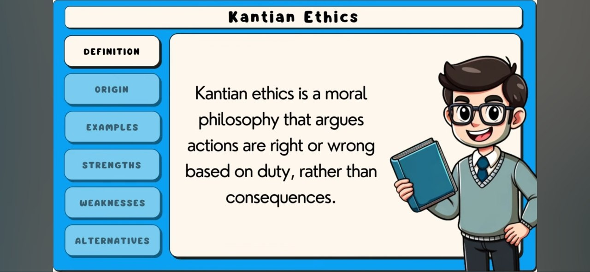
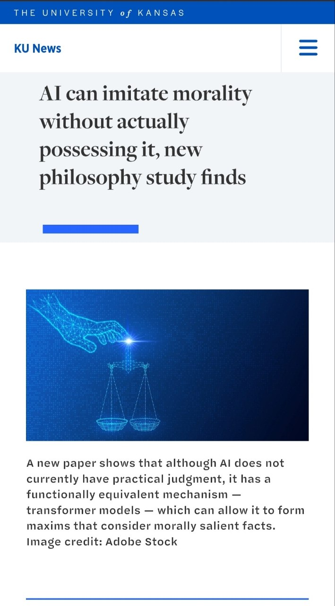
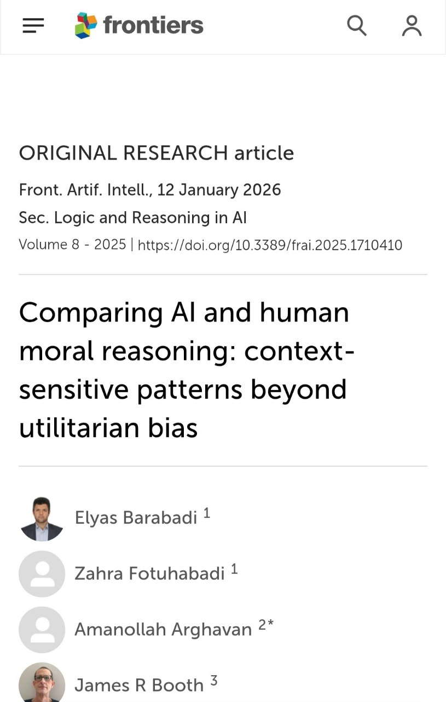

# COIT11223 ICT Ethics and Governance in Society

# e-Portfolio 2 – Ethical Theory (Kantian Ethics)

Student Name: Jahongir Karshiev

Student Number: 12332957

---

# Artefact 1: Introduction to Kantian Ethics

Source: https://youtu.be/QAegvKeHn9U?si=pAkADi75c6taDUfT

## Summary of the artefact
This video explains the basic ideas of Kantian Ethics and the philosophy of Immanuel Kant. It focuses on the idea that people should make ethical decisions based on their moral duties and principles, rather than only thinking about the consequences. It also explains the importance of treating people with respect and not using them simply as a means to achieve a personal goal. I found this useful because it gave me a simple introduction to Kantian Ethics.

## Justification on why I chose the artefact
When I first heard about Kantian Ethics, there were elements of the ideas which confused me – particularly the idea of moral duty. So, I thought it would be helpful if I could find an easy explanation of the theories behind Kantian ethics.
I decided on using this video as the content gave me an accessible insight into what was really happening behind the scenes of this approach to ethics. As someone who has had to make many choices during the course of their career, it’s interesting to see how these can be framed through different theories and the way the author explained ethical decision-making in terms of situations we face every day helps us to recognise our responsibilities in relation to other people. In particular, it encouraged me to consider issues such as my own responsibility towards people when working within Information & Communication Technology (ICT).
# Artefact 2: News Article

Source:
https://news.ku.edu/news/article/ai-can-imitate-morality-without-actually-possessing-it-new-philosophy-study-finds

## Summary of the artefact
This article discusses whether artificial intelligence can really be considered moral or whether it can only imitate human moral behaviour. The article explains research based on Kantian ethics and suggests that AI systems can follow patterns that look like moral reasoning, even though they are not moral agents themselves. It also explains how Kantian ideas about duty, principles and ethical behaviour could be used when developing AI systems. I found this interesting because it connects an ethical theory from philosophy with a modern ICT issue.

## Justification on why I chose the artefact
For this reason, I decided on this topic as I am always fascinated with different types of ethical theories and how they relate to what we see around us. In particular, how can we connect Kantian Ethics to something such as Technology and A.I.? This really made me sit back and consider my own actions as well as those performed by other individuals around me.

Furthermore, it prompted me to consider if these principles are applicable to Artificial Intelligence Systems – i.e., can artificial intelligence become moral without understanding it? Given that all of us (as students) will be studying some form of ICT and ultimately working within this field, it is essential for current and future professionals to understand how technologies can affect people.

---

# Artefact 3: Scholarly Article

Source / DOI

Paste DOI or article link here

## Summary of the artefact

Summarise the main arguments of the scholarly article and explain how they relate to Kantian Ethics.

Remember to include in-text citations with page numbers where appropriate.

## Justification on why I chose the artefact

Explain why this scholarly article improved your understanding of ethical decision-making in ICT. Discuss any interesting examples, ethical concerns, or professional responsibilities mentioned in the article and how they relate to the workshop content.

---

# Artefact 4: Workshop Personal Reflection

Insert your workshop selfie.

Insert a screenshot of the lecture slide if appropriate.

## Summary of the artefact: My Personal Reflection

Write about what you learned during this week's workshop. Describe the activities completed in class, the discussions that took place, and the ethical concepts you found most interesting. Explain how your understanding of Kantian Ethics has improved and how it may influence your future career as an ICT professional.

## Justification on why I chose the artefact

Explain why your workshop participation is meaningful evidence of your learning. Reflect on the discussions with your tutor and classmates, any questions that challenged your thinking, and how the workshop helped you understand ethical decision-making in ICT.

---

# AI Planning Statement

I used AI during the planning stage of this assessment to help organise ideas, identify suitable artefacts, and improve the structure of my portfolio. I reviewed the suggested information, checked all sources, and wrote the final reflections in my own words.

---

# References (CQU Harvard Style)

Reference 1

Reference 2

Reference 3

Reference 4
